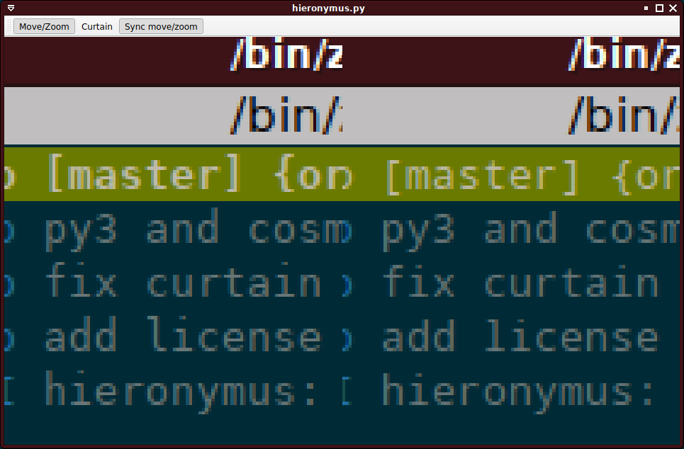
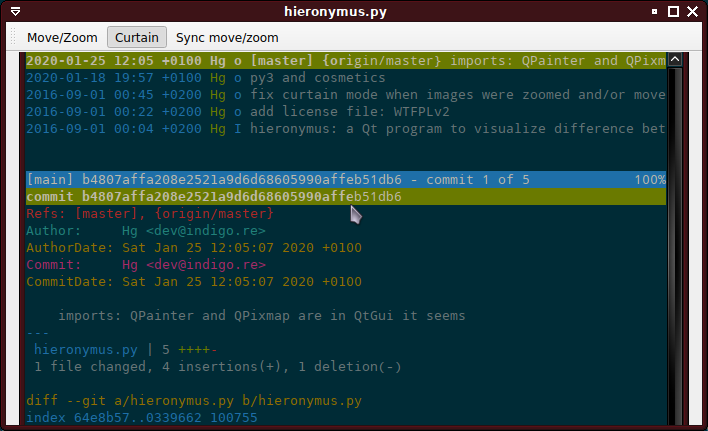

# Hieronymus

Hieronymus is an image comparison app.

It supports viewing 2 images aside of each other, scrolling and zooming in synchronisation the 2 images.

It also supports a "curtain mode", where the 2 images are displayed in the same area, at the left side of the mouse cursor showing the first image and the second image at the right of the mouse cursor, allowing to view the difference progressively with cursor like a curtain.

## Name

The app is named after [Hieronymus Bosch](https://en.wikipedia.org/wiki/Hieronymus_Bosch), a great Dutch painter.

## Requirements

Hieronymus is written in Python 3 and uses PyQt5.

## License

Hieronymus is licensed under [WTFPL v2](COPYING.WTFPL).
